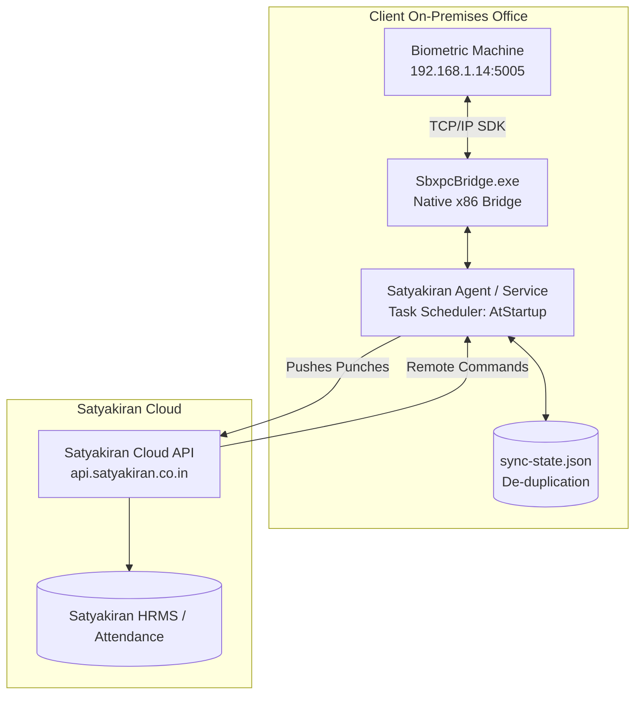

# 🏢 Satyakiran Biometric Cloud Bridge Agent

Enterprise-grade, standalone Windows Bridge Agent connecting **Realtime Biometric Hardware (T501, RS9W, T304f, RS910, etc.)** directly to **Satyakiran AWS Cloud (`api.satyakiran.co.in`)** with **2-Way Synchronization** and **Zero Third-Party Cloud Subscription Costs**.

---

## 🚀 Key Highlights & What Was Achieved

### 1. ⚡ Native Windows Executable Generation (`.exe`)
- **Direct Hardware Bridge (`SbxpcBridge.exe`)**: Built natively in C# targeting 32-bit (`x86`) .NET Framework 4.0/4.8. Directly talks to `SBXPCDLL_Net.dll` for millisecond-fast biometric log retrieval, user management, and device inspections.
- **Standalone 2-Way Sync Engine (`SatyakiranBiometricAgent.exe`)**: Complete standalone daemon with embedded HTTP health server, cloud webhook integration, and automatic state management.
- **Built-in Build Automation (`scripts/build-native-exe.ps1`)**: Single-command script to compile, optimize, and Authenticode-sign all binaries using Windows built-in `csc.exe`.

### 2. 🛠️ Fixed Auto-Startup & Background Service
- **Root Cause of Previous Failure**: The legacy `.bat` shortcut was placed in the user's `%APPDATA%\Startup` folder, which required a user to manually log in after every Windows reboot. Additionally, environment `PATH` differences prevented Node.js from resolving at startup.
- **Permanent Solution Implemented**:
  - **Windows Task Scheduler Service (`SatyakiranBridge`)**: Configured with `AtStartup` trigger running under the `SYSTEM` account. The agent starts immediately when the PC powers on—even on lock screen without any user login.
  - **User Registry Auto-Run & Startup Shortcut Fallbacks**: Multi-tier auto-start mechanism ensuring 24/7 continuous operation.
  - **Updated `install-autostart.bat`**: 1-click script that registers the native background engine.

### 3. 🔄 Robust 2-Way Synchronization
- **Way 1 (Hardware ➔ Cloud)**: 
  - Polls punch records (Face, Fingerprint, Card, Password) every 30 seconds.
  - Automatic de-duplication using `sync-state.json` ensures zero duplicate punches.
  - Batch uploads punches directly to the Satyakiran AWS Cloud HRMS endpoint (`/biometric-push`).
- **Way 2 (Cloud ➔ Hardware)**:
  - Fetches pending remote commands (`SET_USER`, `DELETE_USER`, `ENABLE_USER`, `DISABLE_USER`, `SYNC_TIME`).
  - Executes them directly on the biometric machine and sends execution acknowledgements back to the cloud.

### 4. 🛡️ Fault Tolerance & Offline Protection
- **Zero Data Loss on Power Loss / Shutdown**: Biometric logs remain in the device's 100,000-log flash memory. Upon reboot/network reconnection, the agent catches up and pushes all pending punches.
- **Local Health API**: Embedded HTTP server running on `http://localhost:5006/health` for instant health diagnostics and monitoring.

---

## 📁 System Architecture



---

## 📦 Quick Setup & Installation

### Step 1: Configure `config.json`
Update `config.json` with the machine IP and cloud credentials:
```json
{
  "machine": {
    "ip": "192.168.1.14",
    "port": 5005,
    "machineNumber": 1,
    "password": 0,
    "deviceName": "Sonipat Plant Biometric Machine"
  },
  "cloud": {
    "apiUrl": "https://api.satyakiran.co.in/api/v1/hrms/attendance/biometric-push",
    "authToken": "satyakiran_biometric_2026",
    "branchId": "0fe39d99-31fb-4753-aa6c-704499bdbba9",
    "syncIntervalSeconds": 30
  }
}
```

### Step 2: Build Native Executables (Optional if pre-compiled)
Run in PowerShell:
```powershell
powershell -ExecutionPolicy Bypass -File scripts\build-native-exe.ps1
```

### Step 3: Test Connection
Test connection with both the biometric hardware and AWS Cloud:
```cmd
npm run test-connection
```
Or test directly via CLI:
```cmd
SbxpcBridge.exe test-conn 1 192.168.1.14 5005 0
```

### Step 4: Enable 24/7 Auto-Start
Right-click **`install-autostart.bat`** and select **"Run as administrator"**.

The agent is now registered in Windows Task Scheduler and will start automatically in the background on every system boot.

---

## 🛠️ CLI Utilities & Commands

| Command | Description |
|---|---|
| `start-agent.bat` | Starts the biometric bridge agent in interactive console mode. |
| `install-autostart.bat` | Configures 24/7 background autostart on Windows boot. |
| `view-raw-logs.bat` | Fetches and displays raw punches from biometric hardware. |
| `inspect-machine.bat` | Displays hardware diagnostic stats (user count, punch count, device clock). |
| `manage-device.bat` | Interactive utility to manage enrolled users and sync device time. |
| `check-health.bat` | Verifies agent health, cloud connectivity, and last sync timestamp. |

---

## 🔒 Security & Reliability
- **TLS 1.2 Encrypted Communication** for all cloud traffic.
- **Code Signed Executables** with Authenticode signatures.
- **Fail-Safe Mutex** prevents multiple instances from conflicting over the biometric machine's TCP port.
- **Automatic Log Rotation** keeps disk usage clean and optimized.
