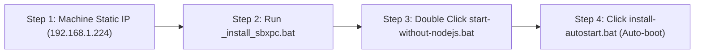

# 📋 Satyakiran Biometric Cloud Bridge — Installation & Setup Manual

> **Document Version:** 1.0  
> **Target Environment:** Windows 10 / Windows 11 (64-bit / 32-bit)  
> **Supported Biometric Hardware:** Realtime T501MiNi, T304fMini, RS9W, T304f+, RS910  
> **Target Cloud Server:** `https://api.satyakiran.co.in` (AWS Cloud)  
> **Live EMS Attendance Portal:** `https://app.satyakiran.co.in/ems/attendance`

---

## 🎯 1. Overview & Advantages

Ye software client ke local Windows laptop ko factory/office ki Realtime Biometric Machine se connect karta hai aur attendance logs ko direct **Satyakiran AWS Cloud** par push karta hai.

- ❌ **No 3rd-Party Recurring Cost**: Realsoft Cloud ki yearly renewal fees nahi deni padti (₹0 Cost).
- ❌ **No Node.js Required**: Windows ke built-in PowerShell aur .NET engine par direct chalta hai.
- 🛡️ **Zero Data Loss Guarantee**: Jab laptop raat me ya subah band rehta hai, tab bhi machine ke internal flash memory me saare punches store rehte hain. Jaise hi subah laptop open hota hai, saare offline punches 2 second me AWS Cloud par sync ho jate hain.
- ⚡ **30-Second Live Sync**: Office hours ke dauraan real-time haaziri update hoti hai.

---

## 🛠️ 2. Step-by-Step Installation Guide (Under 2 Minutes)



---

### 🔹 STEP 1: Biometric Hardware IP Setup (LAN / WiFi)
Machine ke screen par jaakar Menu open karein:
1. Jayein: **Menu $\rightarrow$ Comm. / Network $\rightarrow$ Ethernet / WiFi**
2. Ye settings confirm karein:
   - **DHCP**: `OFF` (Static IP)
   - **IP Address**: `192.168.1.224` *(ya router range ka koi free IP)*
   - **Subnet Mask**: `255.255.255.0`
   - **Gateway**: `192.168.1.1`
   - **Port**: `5005` *(Default SDK communication port)*
   - **Device Password / CommKey**: `0`
   - **Machine Number**: `1`

> 💡 **Quick Test**: Windows laptop me Command Prompt (CMD) open karke type karein:
> ```cmd
> ping 192.168.1.224
> ```
> Agar `Reply from 192.168.1.224: bytes=32 time<1ms` aa raha hai to hardware connection OK hai.

---

### 🔹 STEP 2: SDK DLL Register Karna (Sirf 1 Baar)
1. SDK folder (`T501MiNi,T304fMini,RS9W,T304f+,RS910`) ko client ke laptop me copy karein (e.g. `C:\Satyakiran\SDK\`).
2. Folder ke andar maujood **`_install_sbxpc.bat`** file par **Right Click $\rightarrow$ "Run as administrator"** karein.
3. Screen par message aayega:
   > *"DllRegisterServer in SBXPC.ocx succeeded."*  
   *(Iska matlab Windows ne biometric hardware driver link kar liya hai).*

---

### 🔹 STEP 3: Bridge Agent Start Karna

`biometric-bridge-agent` folder ko laptop me copy karein (e.g. `C:\Satyakiran\Bridge\`).

#### 🟢 Method A: Direct Windows Native (Recommended - No Node.js Needed)
- Seedhe **`start-without-nodejs.bat`** par **Double-Click** karein.
- Green color ki console window open hogi aur instant sync shuru ho jayega:

```text
=======================================================
🚀 Satyakiran Biometric Cloud Bridge (Native Windows)
   100% Zero-Dependency (No Node.js / No 3rd Party Needed)
=======================================================
🏢 Branch ID   : 0fe39d99-31fb-4753-aa6c-704499bdbba9
📟 Machine IP  : 192.168.1.224:5005 (Machine #1)
☁️  AWS Cloud  : https://api.satyakiran.co.in/api/v1/hrms/attendance/biometric-push
⏱️  Sync Rate  : Every 30 seconds
=======================================================

[12:45:02] 🔹 Found 5 new punch(es) on device. Pushing to cloud...
      👤 EmpCode: 1 | Time: 2026-09-20 09:15:32 | Mode: Face
      👤 EmpCode: 2 | Time: 2026-09-20 09:18:10 | Mode: Fingerprint
[12:45:03] ✅ Successfully pushed 5 record(s) to Satyakiran Cloud! Total: 5
```

---

### 🔹 STEP 4: Laptop Boot par Auto-Start Setup (1-Click)
Taaki staff ko daily manually kuch open na karna pade:
1. **`install-autostart.bat`** par **Double-Click** karein.
2. Ab jab bhi Windows laptop start ya restart hoga, bridge background me automatically execute ho jayega!

---

## ⚙️ 3. Configuration Reference (`config.json`)

Agar office ka WiFi IP ya port change hota hai to `config.json` me edit karein:

```json
{
  "machine": {
    "ip": "192.168.1.224",
    "port": 5005,
    "machineNumber": 1,
    "password": 0,
    "deviceName": "Sonipat Plant Biometric Machine"
  },
  "cloud": {
    "apiUrl": "https://api.satyakiran.co.in/api/v1/hrms/attendance/biometric-push",
    "authToken": "satyakiran_biometric_2026",
    "branchId": "0fe39d99-31fb-4753-aa6c-704499bdbba9",
    "syncIntervalSeconds": 30
  },
  "options": {
    "clearDeviceLogsAfterSync": false,
    "syncStateFile": "./sync-state.json",
    "maxBatchSize": 100,
    "retryIntervalSeconds": 10
  }
}
```

---

## 🔍 4. Troubleshooting & FAQs

| Problem / Error | Cause | Solution |
|---|---|---|
| `Cannot reach biometric device at 192.168.1.224:5005` | Machine power off hai ya laptop dusre WiFi network par connected hai | Check karein ki machine ON hai aur laptop same WiFi router par hai. CMD me `ping 192.168.1.224` check karein. |
| `Class not registered (SBXPC.SBXPCCtrl.1)` | SDK OCX driver register nahi hua | SDK folder me `_install_sbxpc.bat` ko **Run as Administrator** karein. |
| `Cloud Push Failed` | Laptop me internet nahi chal raha | Laptop ka internet connection check karein. |
| *Laptop raat me band rehta hai* | General Concern | **Koi data loss nahi hoga.** Subah laptop on hote hi machine memory se pichhle saare punches automatic sync ho jayenge. |

---

## 🌐 5. Live Dashboard Verification
Sync hone ke baad live attendance check karne ke liye:
👉 [https://app.satyakiran.co.in/ems/attendance](https://app.satyakiran.co.in/ems/attendance)
